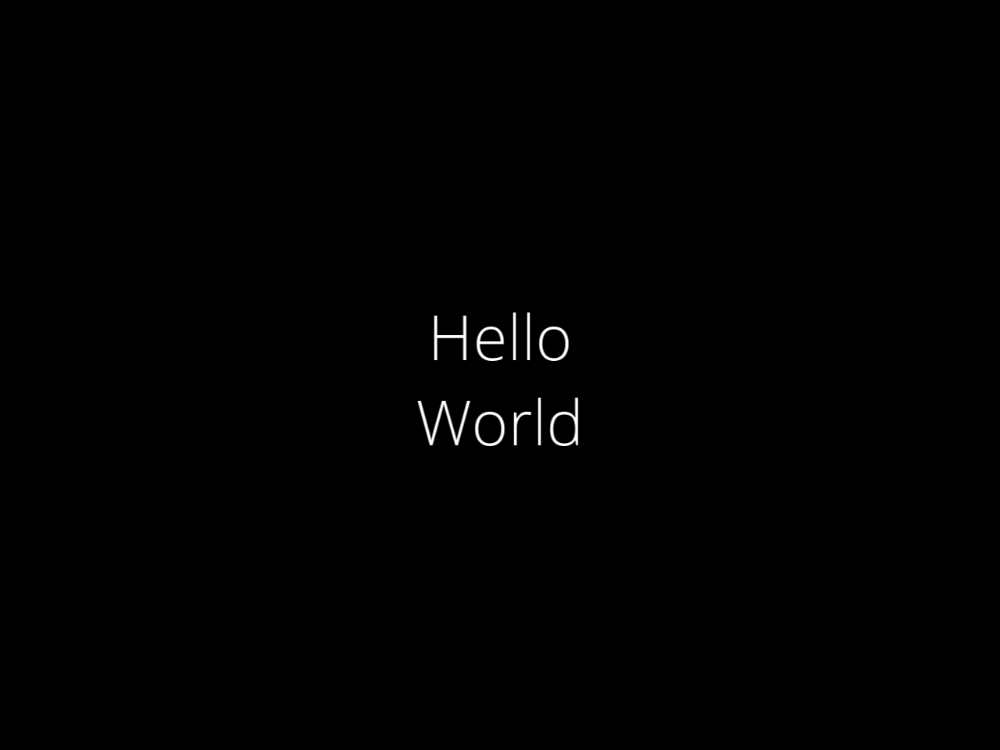
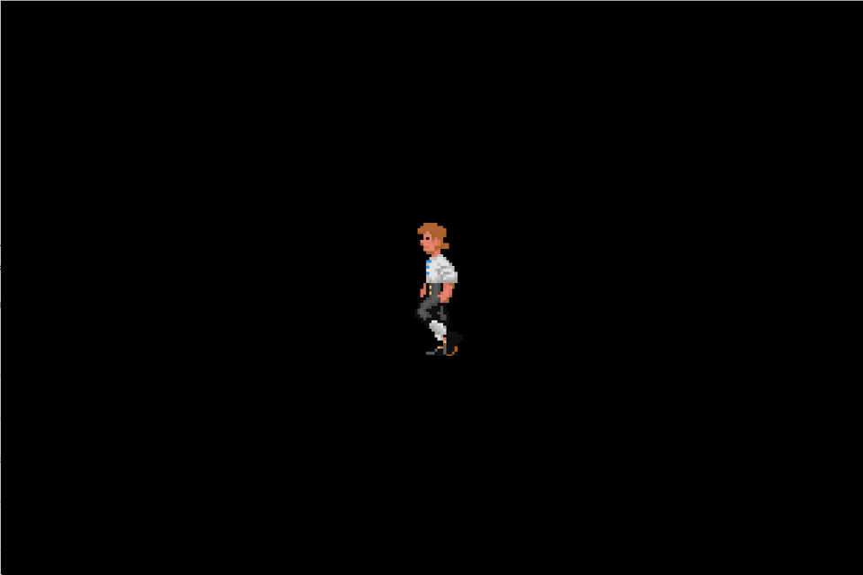

<p align="center">
  
  <br />
  <span style="font-size: smaller;">
    Logo courtesy of <a href="https://github.com/Tobaloidee" rel="nofollow">@Tobaloidee</a>
  </span>
</p>

#

[![Language grade: C/C++][lgtm-cpp-badge]][lgtm-cpp]
[![Code coverage][codecov-badge]][codecov]


Rainbow is a scriptable, cross-platform, 2D game engine. Games can be written in
both C++ and JavaScript/[TypeScript](https://www.typescriptlang.org/). Check
out the [examples](#examples) below.

[[Documentation](https://tido64.github.io/rainbow/)] Get started. It's a good
place to start learning what you can do with Rainbow.

[[Forum](https://www.reddit.com/r/rainbowtech)] Get answers, or even better,
share your awesome work!

[[Roadmap](https://github.com/tido64/rainbow/projects)] Find planned features
and future directions (the old board can be found on
[Trello](https://trello.com/b/r2TqudY6/rainbow)).

Rainbow currently runs on the following platforms:

| Platform    | Status                                                      |
|:------------|:------------------------------------------------------------|
| Windows     | [![Windows Build Status][gh-actions-badge]][gh-actions]     |
| macOS       | [![macOS Build Status][gh-actions-badge]][gh-actions]       |
| Linux       | [![Linux Build Status][gh-actions-badge]][gh-actions]       |
| Android     | [![Android Build Status][gh-actions-badge]][gh-actions]     |
| iOS         | [![iOS Build Status][gh-actions-badge]][gh-actions]         |
| Emscripten (experimental) | [![Emscripten Build Status][gh-actions-badge]][gh-actions]  |

We even have a prototype that runs in your browser.
[Give it a try!](https://tido64.github.io/rainbow.js/)

## Examples

### Label

```typescript
const label = new Rainbow.Label()
  .alignment(Rainbow.TextAlignment.Center)
  .font("OpenSans-Light.ttf")
  .fontSize(60)
  .position({ x: screenWidth * 0.5, y: screenHeight * 0.55 })
  .text("Hello\nWorld");

Rainbow.RenderQueue.add(label);
```



### Sprite Sheet Animation

```typescript
const texture = new Rainbow.Texture("monkey.png");

const batch = new Rainbow.SpriteBatch(1);
batch.setTexture(texture);

const sprite = batch.createSprite(104, 149);
sprite.position({ x: screenWidth * 0.5, y: screenHeight * 0.5 });

const frames = [
  { left: 400, bottom: 724, width: 104, height: 149 },
  { left: 504, bottom: 724, width: 104, height: 149 },
  { left: 608, bottom: 724, width: 104, height: 149 },
  { left: 712, bottom: 724, width: 104, height: 149 },
  { left: 816, bottom: 724, width: 104, height: 149 },
  { left: 920, bottom: 724, width: 104, height: 149 },
];

const animation = new Rainbow.Animation(sprite, frames, 6, 0);
animation.start();

Rainbow.RenderQueue.add(batch);
Rainbow.RenderQueue.add(animation);
```



## Structure

    rainbow
    ├── build    # Build related files
    ├── doc      # Documentation
    ├── include  # Public Rainbow headers
    ├── js       # JS playground
    ├── lib      # Third party dependencies
    ├── src      # Rainbow source code
    └── tools    # Build scripts, JS bindings generator, and other tools...

## Contribute

* [Submit bugs](https://github.com/tido64/rainbow/issues).
* [Review code, or submit fixes and improvements](https://github.com/tido64/rainbow/pulls).
* Please make sure to read our
  [coding standard](https://tido64.github.io/rainbow/docs/coding-standard).

## Visual Studio Test Adapter for Google Test

Rainbow uses [Google Test](https://github.com/google/googletest). To make Visual
Studio recognize the tests, you'll need to install
[Test Adapter for Google Test](https://marketplace.visualstudio.com/items?itemName=VisualCPPTeam.TestAdapterforGoogleTest)
and set the working directory in **Test** ❭ **Options…** ❭
**Test Adapter for Google Test**:

* Working directory: `$(SolutionDir)`

You'll also need to copy `SDL2.dll` into `$(SolutionDir)\$(Configuration)`, e.g.
`$(SolutionDir)\Debug`, because Test Adapter for Google Test doesn't honour the
working directory setting when discovering tests.

## Dependencies

| Name                | Version | License      | Required |
|---------------------|---------|--------------|:--------:|
| [Abseil][]          | 111ca70 | Apache 2.0   |    ✓     |
| [cubeb][]           | 03ec1b3 | ISC          |    ✓     |
| [Dear ImGui][]      | 1.79    | MIT          |    ✓     |
| [Duktape][]         | 2.5.0   | MIT          |    ✓     |
| [FreeType][]        | 2.10.1  | FreeType     |    ✓     |
| [HarfBuzz][]        | 2.6.4   | Old MIT      |    ✓     |
| [libpng][]          | 1.6.37  | libpng v2    |    ✓     |
| [Mapbox Variant][]  | 1.2.0   | BSD-3        |    ✓     |
| [NanoSVG][]         | cc6c08d | zlib         |    ✓     |
| [Ogg Vorbis][]      | 1.3.7   | BSD-3        |    ✓     |
| [PhysicsFS][]       | 3.0.2   | zlib         |    ✓     |
| [SDL][]             | 2.0.12  | zlib         |    ✓     |
| [zlib][]            | 1.2.11  | zlib         |    ✓     |
| [Box2D][]           | 2.4.0   | MIT          |          |
| [FMOD][]            | 1.05.x  | Proprietary  |          |

## License

Copyright (c) 2010-present Bifrost Entertainment AS and Tommy Nguyen.

Permission is hereby granted, free of charge, to any person obtaining a copy
of this software and associated documentation files (the "Software"), to deal
in the Software without restriction, including without limitation the rights
to use, copy, modify, merge, publish, distribute, sublicense, and/or sell
copies of the Software, and to permit persons to whom the Software is
furnished to do so, subject to the following conditions:

The above copyright notice and this permission notice shall be included in
all copies or substantial portions of the Software.

THE SOFTWARE IS PROVIDED "AS IS", WITHOUT WARRANTY OF ANY KIND, EXPRESS OR
IMPLIED, INCLUDING BUT NOT LIMITED TO THE WARRANTIES OF MERCHANTABILITY,
FITNESS FOR A PARTICULAR PURPOSE AND NONINFRINGEMENT. IN NO EVENT SHALL THE
AUTHORS OR COPYRIGHT HOLDERS BE LIABLE FOR ANY CLAIM, DAMAGES OR OTHER
LIABILITY, WHETHER IN AN ACTION OF CONTRACT, TORT OR OTHERWISE, ARISING FROM,
OUT OF OR IN CONNECTION WITH THE SOFTWARE OR THE USE OR OTHER DEALINGS IN
THE SOFTWARE.

<!-- Badges -->
[codecov]: https://codecov.io/gh/tido64/rainbow
[codecov-badge]: https://codecov.io/gh/tido64/rainbow/branch/master/graph/badge.svg
[gh-actions]: https://github.com/tido64/rainbow/actions/workflows/main.yml
[gh-actions-badge]: https://github.com/tido64/rainbow/actions/workflows/main.yml/badge.svg
[lgtm-cpp]: https://lgtm.com/projects/g/tido64/rainbow/context:cpp
[lgtm-cpp-badge]: https://img.shields.io/lgtm/grade/cpp/g/tido64/rainbow.svg?logo=lgtm&logoWidth=18

<!-- Dependencies -->
[Abseil]: https://abseil.io/ "Abseil"
[Box2D]: http://box2d.org/ "Box2D | A 2D Physics Engine for Games"
[cubeb]: https://github.com/kinetiknz/cubeb "cubeb"
[Dear ImGui]: https://github.com/ocornut/imgui "Dear ImGui"
[Duktape]: https://duktape.org/ "Duktape"
[FMOD]: https://www.fmod.com/ "FMOD"
[FreeType]: https://freetype.org/ "FreeType"
[HarfBuzz]: https://wiki.freedesktop.org/www/Software/HarfBuzz/ "HarfBuzz"
[libpng]: https://github.com/glennrp/libpng "libpng"
[Mapbox Variant]: https://github.com/mapbox/variant "Mapbox Variant"
[NanoSVG]: https://github.com/memononen/nanosvg "NanoSVG"
[Ogg Vorbis]: https://xiph.org/vorbis/ "Ogg Vorbis"
[PhysicsFS]: https://www.icculus.org/physfs/ "PhysicsFS"
[SDL]: https://www.libsdl.org/ "Simple DirectMedia Layer"
[zlib]: https://github.com/madler/zlib "zlib"
