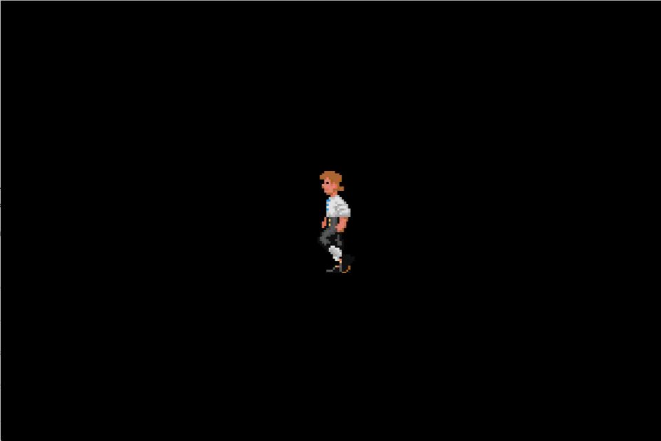

import Tabs from "@theme/Tabs";
import TabItem from "@theme/TabItem";

A sprite sheet animation is a frame-based animation (like traditional animation)
where we take a sprite and change its texture at set interval.

## Animation Management

### Creating Sprite Sheet Animations

<Tabs
  groupId="programming-language"
  defaultValue="ts"
  values={[
    { label: "TypeScript", value: "ts", },
    { label: "C++", value: "cpp", },
  ]}
>
<TabItem value="ts">

```typescript
Rainbow.Animation(sprite: Sprite, frames: Rect[], fps: number, delay: number)
```

</TabItem>
<TabItem value="cpp">

```cpp
Animation(const SpriteRef& sprite,
          std::unique_ptr<Rect[]> frames,
          unsigned int fps,
          int delay = 0);
```

</TabItem>
</Tabs>

`frames` is an array of texture areas that are played back in succession. In
C++, the array must be terminated with `Animation::end_frame()`. The playback
rate is determined by frames per second, or `fps`.

By default, an animation always loops without any delays between each cycle.
Setting `delay` to anything greater than 0, will introduce delays, measured in
frames. For instance, setting `fps` to 25 and `delay` to 2, will make the
animation wait **80 ms** before playing the next cycle. A negative `delay`
disables looping.

Before an animation can be played, it must also be added to the render queue.
Note that animations can be assigned a sprite at any point in time, so it is
possible to cache them for later use.

### Starting and Stopping Animations

<Tabs
  groupId="programming-language"
  defaultValue="ts"
  values={[
    { label: "TypeScript", value: "ts", },
    { label: "C++", value: "cpp", },
  ]}
>
<TabItem value="ts">

```typescript
function start(): void;
function stop(): void;
```

</TabItem>
<TabItem value="cpp">

```cpp
auto Animation::is_stopped() const -> bool;
void Animation::start();
void Animation::stop();
```

</TabItem>
</Tabs>

An animation will always start from the beginning. There is no pause function
because animations live in the render queue and can therefore be paused by
disabling the render unit itself.

### Navigating the Animation

<Tabs
  groupId="programming-language"
  defaultValue="ts"
  values={[
    { label: "TypeScript", value: "ts", },
    { label: "C++", value: "cpp", },
  ]}
>
<TabItem value="ts">

```typescript
function currentFrame(): number;
```

</TabItem>
<TabItem value="cpp">

```cpp
auto current_frame() const -> unsigned int;
```

</TabItem>
</Tabs>

Returns the currently displayed frame; **-1** if none.

<Tabs
  groupId="programming-language"
  defaultValue="ts"
  values={[
    { label: "TypeScript", value: "ts", },
    { label: "C++", value: "cpp", },
  ]}
>
<TabItem value="ts">

```typescript
function frameRate(): number;
```

</TabItem>
<TabItem value="cpp">

```cpp
auto frame_rate() const -> unsigned int;
```

</TabItem>
</Tabs>

Returns the frame rate in frames per second.

<Tabs
  groupId="programming-language"
  defaultValue="ts"
  values={[
    { label: "TypeScript", value: "ts", },
    { label: "C++", value: "cpp", },
  ]}
>
<TabItem value="ts">

```typescript
function jumpTo(frame: number): void;
```

</TabItem>
<TabItem value="cpp">

```cpp
void Animation::jump_to(unsigned int frame);
```

</TabItem>
</Tabs>

Jumps to the specified frame.

<Tabs
  groupId="programming-language"
  defaultValue="ts"
  values={[
    { label: "TypeScript", value: "ts", },
    { label: "C++", value: "cpp", },
  ]}
>
<TabItem value="ts">

```typescript
function rewind(): void;
```

</TabItem>
<TabItem value="cpp">

```cpp
void Animation::rewind();
```

</TabItem>
</Tabs>

Rewinds the animation. Equivalent to `jump_to(0)`.

### Modifying the Animation Sequence

<Tabs
  groupId="programming-language"
  defaultValue="ts"
  values={[
    { label: "TypeScript", value: "ts", },
    { label: "C++", value: "cpp", },
  ]}
>
<TabItem value="ts">

```typescript
function setDelay(delay: number): void;
```

</TabItem>
<TabItem value="cpp">

```cpp
void Animation::set_delay(int delay);
```

</TabItem>
</Tabs>

Sets number of frames to delay before the animation loops. Negative numbers
disable looping.

<Tabs
  groupId="programming-language"
  defaultValue="ts"
  values={[
    { label: "TypeScript", value: "ts", },
    { label: "C++", value: "cpp", },
  ]}
>
<TabItem value="ts">

```typescript
function setFrameRate(fps: number): void;
```

</TabItem>
<TabItem value="cpp">

```cpp
void Animation::set_frame_rate(unsigned int fps);
```

</TabItem>
</Tabs>

Sets the frame rate in frames per second.

<Tabs
  groupId="programming-language"
  defaultValue="ts"
  values={[
    { label: "TypeScript", value: "ts", },
    { label: "C++", value: "cpp", },
  ]}
>
<TabItem value="ts">

```typescript
function setFrames(frames: Rect[]): void;
```

</TabItem>
<TabItem value="cpp">

```cpp
void Animation::set_frames(std::unique_ptr<Rect[]> frames);
```

</TabItem>
</Tabs>

Sets new frames to be played.

```cpp
auto release() -> const Rect*;
```

**C++ only:** Releases ownership of animation frames and returns it.

### Changing Sprite To Animate

```cpp
auto sprite() const -> SpriteRef;
```

Returns the target sprite.

<Tabs
  groupId="programming-language"
  defaultValue="ts"
  values={[
    { label: "TypeScript", value: "ts", },
    { label: "C++", value: "cpp", },
  ]}
>
<TabItem value="ts">

```typescript
function setSprite(sprite: Sprite): void;
```

</TabItem>
<TabItem value="cpp">

```cpp
void Animation::set_sprite(const SpriteRef&);
```

</TabItem>
</Tabs>

Sets the sprite to animate.

## Animation Callback Events

There are three events that are fired during an animation's lifetime.

* `AnimationEvent::Start` fires when a stopped animation is started.
* `AnimationEvent::End` fires when an animation is stopped.
* `AnimationEvent::Complete` fires immediately after an animation completes a
  single cycle, before the delay preceding the next.
* `AnimationEvent::Frame` fires for each frame that does not trigger `End` or
  `Complete` events.

You can subscribe to these events using:

<Tabs
  groupId="programming-language"
  defaultValue="ts"
  values={[
    { label: "TypeScript", value: "ts", },
    { label: "C++", value: "cpp", },
  ]}
>
<TabItem value="ts">

```typescript
function setCallback(callback: (animation: Animation, event: AnimationEvent) => void): void;

// Example:

(animation, event) => {
  switch (event) {
    case Rainbow.AnimationEvent.Start:
      console.log("> Animation has started");
      break;
    case Rainbow.AnimationEvent.End:
      console.log("> Animation has ended");
      break;
    case Rainbow.AnimationEvent.Complete:
      console.log("> Animation has completed");
      break;
    case Rainbow.AnimationEvent.Frame:
      console.log("> Animation is displaying frame", animation.currentFrame());
      break;
  }
}
```

</TabItem>
<TabItem value="cpp">

```cpp
void Animation::set_callback(Animation::Callback);

// Where `Animation::Callback` is a callable whose
// signature is `void(Animation*, AnimationEvent)`,
// and `animation` is the animation object that
// triggered `event`.
```

</TabItem>
</Tabs>

## Example

In this example, we set up a walking animation.

<Tabs
  groupId="programming-language"
  defaultValue="ts"
  values={[
    { label: "TypeScript", value: "ts", },
    { label: "C++", value: "cpp", },
  ]}
>
<TabItem value="ts">

```typescript
/// <reference path="./index.d.ts" />

type World = {
  screen: { width: number; height: number };
  texture: Rainbow.Texture;
  batch: Rainbow.SpriteBatch;
  animation: Rainbow.Animation;
};

let world: World;

function init(width: number, height: number) {
  const texture = new Rainbow.Texture("monkey.png");

  const batch = new Rainbow.SpriteBatch(1);
  batch.setTexture(texture);

  const sprite = batch.createSprite(104, 149);
  sprite.position({ x: width * 0.5, y: height * 0.5 });

  const walkingFrames = [
    { left: 400, bottom: 724, width: 104, height: 149 },
    { left: 504, bottom: 724, width: 104, height: 149 },
    { left: 608, bottom: 724, width: 104, height: 149 },
    { left: 712, bottom: 724, width: 104, height: 149 },
    { left: 816, bottom: 724, width: 104, height: 149 },
    { left: 920, bottom: 724, width: 104, height: 149 },
  ];
  const animation = new Rainbow.Animation(sprite, walkingFrames, 6, 0);
  animation.start();

  Rainbow.RenderQueue.add(batch);
  Rainbow.RenderQueue.add(animation);

  world = {
    screen: { width, height },
    texture,
    batch,
    animation
  };
}

function update(dt: number) {}
```

</TabItem>
<TabItem value="cpp">

```cpp
#include "Graphics/Animation.h"
#include "Graphics/SpriteBatch.h"
#include "Script/GameBase.h"

namespace
{
  auto make_frames()
  {
    auto frames = new rainbow::Rect[7]{
      {400, 724, 104, 149},
      {504, 724, 104, 149},
      {608, 724, 104, 149},
      {712, 724, 104, 149},
      {816, 724, 104, 149},
      {920, 724, 104, 149},
      rainbow::Animation::end_frame(),
    };
    return std::unique_ptr<rainbow::Rect[]>{frames};
  }
}

void animation_event_handler(rainbow::Animation*,
                             rainbow::AnimationEvent e)
{
  switch (e) {
    case rainbow::AnimationEvent::Start:
      // Handle animation start here.
      break;
    case rainbow::AnimationEvent::End:
      // Handle animation end here.
      break;
    case rainbow::AnimationEvent::Complete:
      // Handle animation cycle complete here.
      break;
    case rainbow::AnimationEvent::Frame:
      // Handle animation frame update here.
      break;
  }
}

class AnimationExample final : public rainbow::GameBase
{
public:
  AnimationExample(rainbow::Director& director)
    : rainbow::GameBase(director),
      batch_(1),
      animation_({}, make_frames(), 6, 0)
  {
  }

private:
  rainbow::graphics::Texture texture_;
  rainbow::SpriteBatch batch_;
  rainbow::Animation animation_;

  void init_impl(const rainbow::Vec2i& screen) override
  {
    texture_ = texture_provider().get(
        "monkey.png",
        1.0F,
        rainbow::graphics::Filter::Nearest,
        rainbow::graphics::Filter::Nearest);

    batch_.set_texture(texture_);

    auto sprite = batch_.create_sprite(104, 149);
    sprite->position({screen.x * 0.5F, screen.y * 0.5F});

    animation_.set_sprite(sprite);
    animation_.set_callback(&animation_event_handler);
    animation_.start();

    render_queue().emplace_back(batch_);
    render_queue().emplace_back(animation_);
  }
};

auto rainbow::GameBase::create(rainbow::Director& director)
  -> std::unique_ptr<rainbow::GameBase>
{
  return std::make_unique<AnimationExample>(director);
}
```

</TabItem>
</Tabs>

Output:



## Caveats and Known Limitations

Currently, an animation object takes ownership of the frames array and will
attempt to delete it on destruction.
