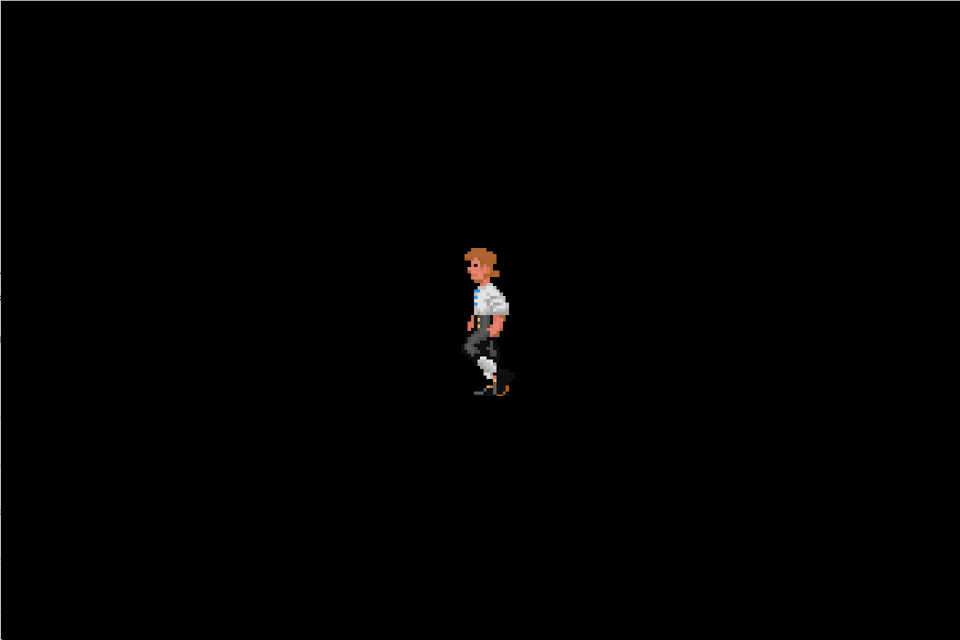

# Sprite Sheet Animations

A sprite sheet animation is a frame-based animation (like traditional animation)
where we take a sprite and change its texture at set intervals.

## Animation Management

### Creating Sprite Sheet Animations

```c++
Animation(const Sprite::Ref &sprite,
          std::unique_ptr<Frame[]> frames,
          const unsigned int fps,
          const int delay = 0);
```

`frames` is an array of texture ids that are played back in succession and is
terminated with `Animation::kAnimationEnd`. The playback rate is determined by
frames per second, or `fps`.

By default, an animation always loops without any delays between each cycle.
Setting `delay` to anything greater than 0, will introduce delays, measured in
frames. For instance, setting `fps` to 30 and `delay` to 2, will make the
animation wait 66⅔ ms before playing the next cycle. A negative `delay`
disables looping.

Before an animation can be played, it must also be added to the scene graph.
Typically, it is added as a child node of the sprite's batch node. This makes it
easier to enable and disable batches along with their animations. This also
means that batches of animations can be created and assigned a sprite at a later
point in time.

### Starting and Stopping Animations

```c++
bool  Animation::is_stopped  () const;
void  Animation::start       ();
void  Animation::stop        ();
```

An animation will always start from the beginning. There is no pause function
because animations live in the scene graph, and can therefore be paused by
disabling its node.

### Navigating the Animation

```c++
unsigned int  current_frame  () const;
```

Returns the currently displayed frame; `Animation::kAnimationEnd` if none.

```c++
unsigned int  frame_rate  () const;
```

Returns the frame rate in frames per second.

```c++
void  Animation::jump_to  (const unsigned int frame);
```

Jumps to the specified frame.

```c++
void  Animation::rewind  ();
```

Rewinds the animation. Equivalent to `jump_to(0)`.

### Modifying the Animation Sequence

```c++
void  Animation::set_delay  (const int delay);
```

Sets number of frames to delay before the animation loops. Negative numbers
disable looping.

```c++
void  Animation::set_frame_rate  (const unsigned int fps);
```

Sets the frame rate in frames per second.

```c++
void  Animation::set_frames  (std::unique_ptr<Frame[]> frames);
```

Sets new frames to be played.

### Changing Sprite To Animate

```c++
void  Animation::set_sprite  (const Sprite::Ref &sprite);
```

Sets the sprite to animate.

### Animation Callback Events

There are three events that are fired during an animation's lifetime.

* `Animation::Event::Start` fires when a stopped animation is started.

* `Animation::Event::End` fires when an animation is stopped.

* `Animation::Event::Complete` fires immediately after an animation completes a
  single cycle, before the delay preceding the next.

* `Animation::Event::Frame` fires for each frame that does not trigger `End` or
  `Complete` events.

You can subscribe to these events using:

```c++
void   Animation::set_callback  (Animation::Callback f);
```

Where `Animation::Callback` is a callable whose signature is
`void(Animation *animation, const Animation::Event event)`, and `animation` is
the animation object that triggered `event`.

## Example

In this example, we set up a walking animation using the simplified API.

```c++
#include "Script/GameBase.h"

namespace
{
    const unsigned int kNumTextureRegions = 24;

    const unsigned int kTextureRegions[kNumTextureRegions]{
        400, 724, 104, 149,
        504, 724, 104, 149,
        608, 724, 104, 149,
        712, 724, 104, 149,
        816, 724, 104, 149,
        920, 724, 104, 149};
}

Animation::Frames create_animation_frames()
{
    return Animation::Frames(
        new Animation::Frame[7]{0, 1, 2, 3, 4, 5, Animation::kAnimationEnd});
}

rainbow::texture_t load_texture()
{
    auto texture = rainbow::texture("monkey.png");
    for (unsigned int i = 0; i < kNumTextureRegions; i += 4)
    {
        texture->define(
            Vec2i(kTextureRegions[i], kTextureRegions[i + 1]),
            kTextureRegions[i + 2],
            kTextureRegions[i + 3]);
    }
    return texture;
}

void animation_event_handler(Animation *, const Animation::Event e)
{
    switch (e)
    {
        case Animation::Event::Start:
            // Handle animation start here.
            break;
        case Animation::Event::End:
            // Handle animation end here.
            break;
        case Animation::Event::Complete:
            // Handle animation cycle complete here.
            break;
        case Animation::Event::Frame:
            // Handle animation frame update here.
            break;
    }
}

class AnimationExample final : public GameBase
{
public:
    AnimationExample(rainbow::Director &director) : GameBase(director) {}

    void init(const Vec2i &screen) override
    {
        TextureManager::Get()->set_filter(GL_NEAREST);
        auto texture = load_texture();
        batch_ = rainbow::spritebatch(1);
        batch_->set_texture(texture);

        auto sprite = batch_->create_sprite(104, 149);
        sprite->set_position(Vec2f(screen.x * 0.5f, screen.y * 0.5f));

        animation_ =
            rainbow::animation(sprite, create_animation_frames(), 6, 0);
        animation_->set_callback(&animation_event_handler);

        // Add the sprite batch to the root node, and the animation to the
        // batch's node so we can disable them both easily.
        auto node = scenegraph().add_child(batch_);
        node->add_child(animation_);

        animation_->start();
    }

private:
    rainbow::spritebatch_t batch_;
    rainbow::animation_t animation_;
};

GameBase* GameBase::create(rainbow::Director &director)
{
    return new AnimationExample(director);
}
```

Output:



And an alternative implementation using "manual" object lifetime management:

```c++
class AnimationExample final : public GameBase
{
public:
    AnimationExample(rainbow::Director &director)
        : GameBase(director), batch_(1),
          animation_(Sprite::Ref(), create_animation_frames(), 6, 0) {}

    void init(const Vec2i &screen) override
    {
        TextureManager::Get()->set_filter(GL_NEAREST);
        auto texture = load_texture();
        batch_.set_texture(texture);

        auto sprite = batch_.create_sprite(104, 149);
        sprite->set_position(Vec2f(screen.x * 0.5f, screen.y * 0.5f));

        animation_.set_sprite(sprite);
        animation_.set_callback(&animation_event_handler);

        auto node = scenegraph().add_child(&batch_);
        node->add_child(&animation_);

        animation_.start();
    }

private:
    SpriteBatch batch_;
    Animation animation_;
};
```

## Caveats and Known Issues

Currently, an animation object takes ownership of the frames array and will
attempt to delete it on destruction.
